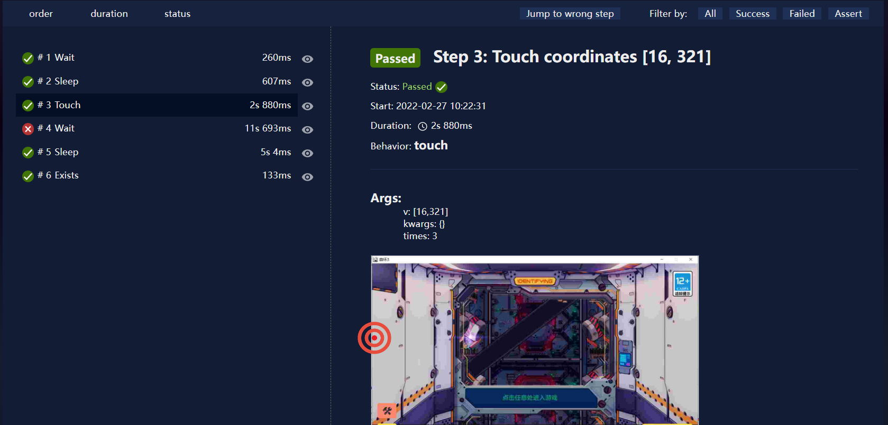

# HonkaiHelper
基于Airtest的PC端崩坏3自动化脚本，采用图色识别方式，并带有防检测机制。

## 前言
现在崩坏3已经进入一个全新的阶段，主线剧情接近尾声，游戏内容开始侧重有关前文明纪元的往世乐土。我已经逐渐失去了凹分的热情，平时战场深渊乐土是一个不打。而自从一键减负常驻，我的崩三日常几乎就是3分钟速通。但弃坑是不可能弃坑的，偶尔看看剧情当个休闲玩家挺舒服，我永远喜欢崩坏3！

为了从无聊的日常中解放出来，这个脚本诞生了。仅需一次运行，完成从启动游戏、完成日常到最后关闭的全过程。不过我还是第一次写这种脚本，尚不清楚米哈游的查封力度，我个人自3月初用到现在还没有出现问题，但不保证万无一失，所以一句话 **用别怕，怕别用**

---
**7月8日更新：**

**下版本我去肝原画集了，官方也特意提到过打击外挂脚本，建议5.9不要使用**


## 功能
- 挂远征
- 家园金币
- 家园打工
- 材料活动一键减负
- 每日活跃奖励
- 凭证奖励
- 邮件奖励
- 商店金币碎片
- 戳老婆
- 每周一次舰团贡献奖励、时序票、吼姆秘宝

## 使用方法
1. 安装Python环境（建议Python3.9）
2. 安装Airtest包
    ```
    pip install airtest==1.2.4
    ```
3. 直接下载或者git clone
    ```
    git clone https://github.com/Aues6uen11Z/HonkaiHelper.git 
    ```
4. 找到config.py修改游戏启动路径
5. 运行main.py文件

## 注意事项

1. 启动路径是游戏本体而非启动器的路径，路径中有空格的部分要带引号，如`"Honkai Impact 3"`
2. **强烈**建议在1280×720窗口模式运行，若使用其他分辨率需要修改config.py中的坐标（有些坐标后来加的时候懒得往config里加了，要是在代码里看到莫名其妙的4个数字就是坐标咯），坐标系的原点位于窗口左上角，不受窗口位置影响。
3. 程序的设定是每天晚6点以后登录一次，若登录早领不到芽衣的便当，体力是不够远征和减负消耗的。
4. 关于远征，需要注意的是第一次使用需要提前攒一天奖励不领，好让脚本每次上线领前一天奖励完成当日活跃任务。
5. 不能保证在每一个人的电脑上都完美运行脚本，有些地方我图省事就直接不加判断的点了（比如家园打工，这是基于我家园角色全齐的选择，缺人大概率会卡。不过也只是少打几个工，程序应该可以顺利进行），若出现异常情况请善用报告（log/log.html)自行修改，若仍有无法解决的问题请在issue中提出。
   

## 开发

该脚本目前仅能完成远征、打工、减负、领活跃奖励等日常操作，若想添加一些自定义的功能，请使用[AirtestIDE](https://airtest.doc.io.netease.com)进行开发，非常的易学易用，不需要高超的技术，可以快速写一个像这样的低端屑作。 在event.py中添加自定义函数，然后在main.py中调用即可。
