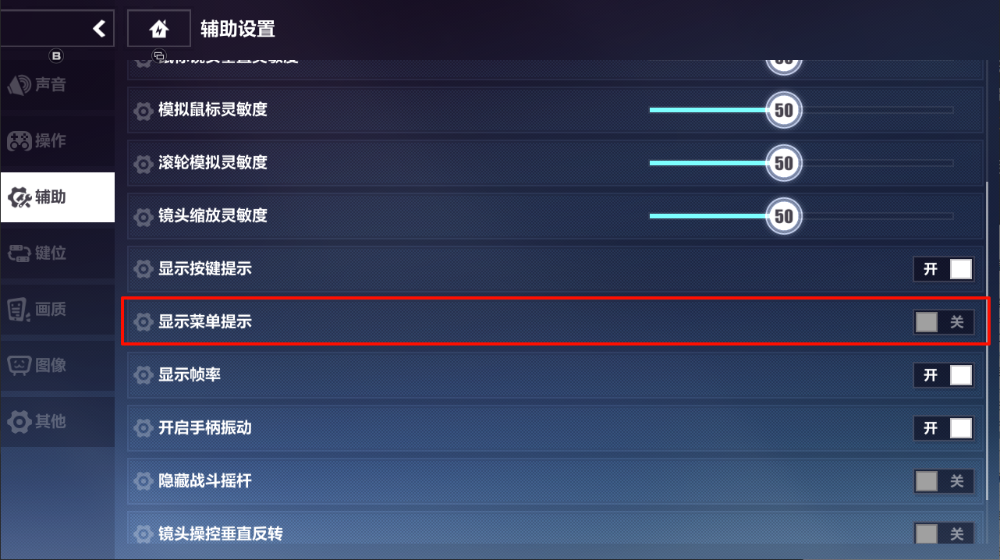
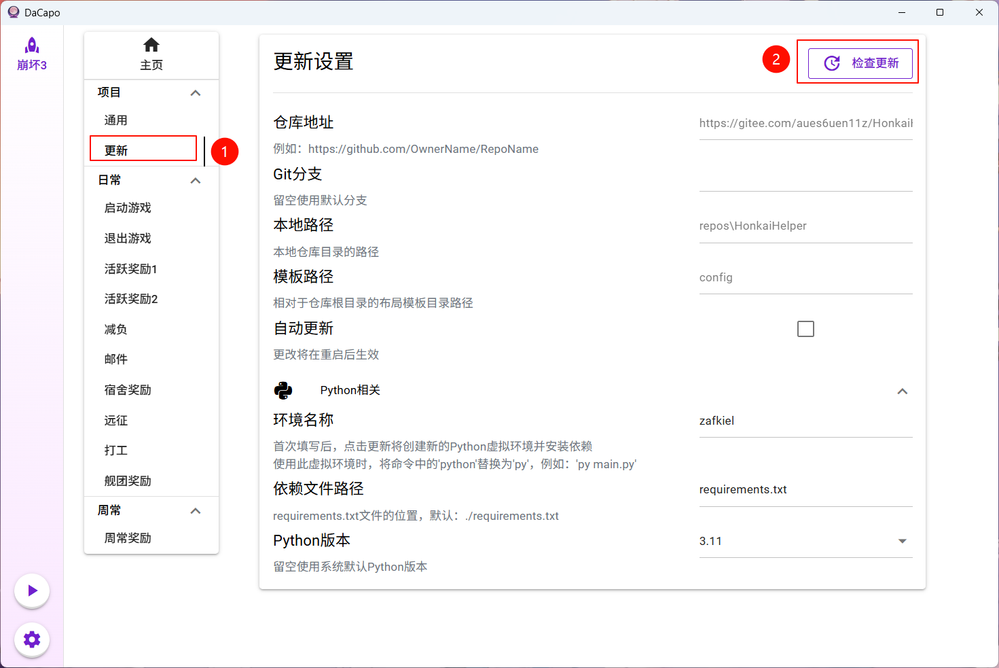
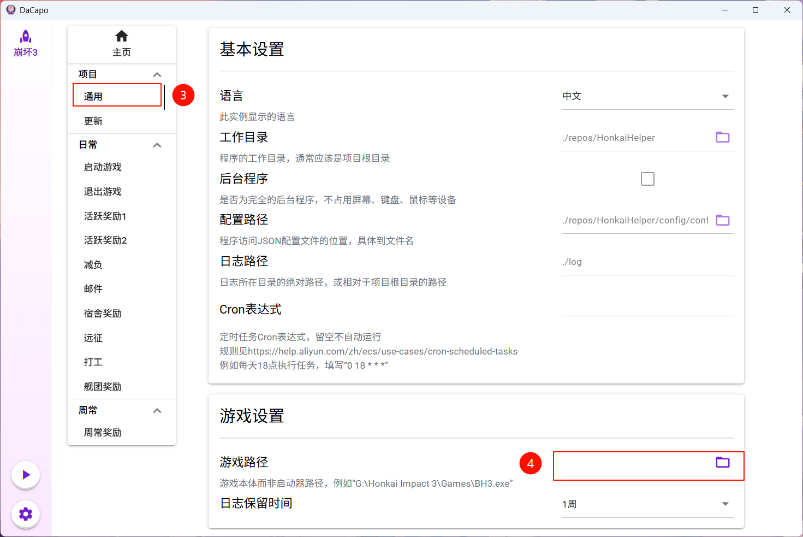

# HonkaiHelper
基于图色识别和OCR的PC端崩坏3自动化脚本，先别退坑，刷刷日常凑登录天数吧~


✨顺便看看如何使用DaCapo接管米家全家桶日常：[赛博代肝从开机到关机](https://github.com/Aues6uen11Z/DaCapo/blob/master/docs/%E8%B5%9B%E5%8D%9A%E4%BB%A3%E8%82%9D%E4%BB%8E%E5%BC%80%E6%9C%BA%E5%88%B0%E5%85%B3%E6%9C%BA.md)

## 功能

- 挂远征、家园打工
- 材料活动一键减负
- 领家园金币、凭证奖励、邮件、每日活跃奖励
- 提交舰团委托、领舰团奖励

## 前置准备

1. 设置-辅助-显示菜单提示：关

2. 设置-画质-分辨率：任意16:9的分辨率，但求稳请使用1280×720或2560×1440

## 使用方法

### 一键包

图形化一键包现已发布，无需配置python环境，支持自动更新，欢迎[下载体验](https://github.com/Aues6uen11Z/HonkaiHelper/releases)。所用的图形化界面[DaCapo](https://github.com/Aues6uen11Z/DaCapo)与本项目完全独立，是一个通用脚本管理器，如果你有其他脚本想放上来，可以自行查看README了解用法。

解压后点击DaCapo.exe启动程序，更新后修改游戏路径，然后回到主页点击按钮即可开始。





### 手动导入

下载并打开DaCapo，点击左下角齿轮图标，在“创建新实例”一栏选择从远程创建，填写以下内容并点击创建：

- 实例名称：随意
- 模板名称：随意
- 仓库地址：`https://gitee.com/aues6uen11z/HonkaiHelper`
- 本地路径：`repos`
- 分支：留空不填
- 模板路径：`config`

### 从源码构建

1. 克隆本项目或直接下载压缩包并解压
```shell
git clone https://github.com/Aues6uen11Z/HonkaiHelper.git 
```

2. 准备Python环境，建议使用conda的新虚拟环境

```shell
# 安装完anaconda或miniconda后进入shell
# 理论上支持3.6以上任意版本，但目前只测试了3.9-3.11
conda create -n zafkiel python==3.9.18
conda activate zafkiel
```

3. 在该环境内安装依赖包

```shell
pip install -r requirements.txt
```

4. 到项目根目录下的config/default.json修改游戏启动路径
5. 在项目根目录运行main.py

```shell
cd 你的存储路径/HonkaiHelper
python main.py
```

## 注意事项

1. 项目更新有时会涉及到依赖更新，若从源码运行，使用时请确保你的zafkiel版本与requirements.txt一致。

   ```shell
   # 在你的虚拟环境内
   pip install --upgrade zafkiel
   ```

2. 目前新版本尚未开发完全，不能保证在每一个人的电脑上都完美运行，出现问题可以在issue中提出，记得附上日志（注意**是.log文件，不是log.txt**）

3. Gitee仓库仅用作同步，不要在那里开issue

## Todo

- [ ] 常用功能
- [x] 图形化界面
- [ ] 安卓模拟器支持
- [ ] 改进日志和网页报告

## 开发

新版本使用了[Zafkiel](https://github.com/Aues6uen11Z/Zafkiel)库，结合了[Airtest](https://github.com/AirtestProject/Airtest)和[StarRailCopilot](https://github.com/LmeSzinc/StarRailCopilot)的一些优点，欢迎尝试。
